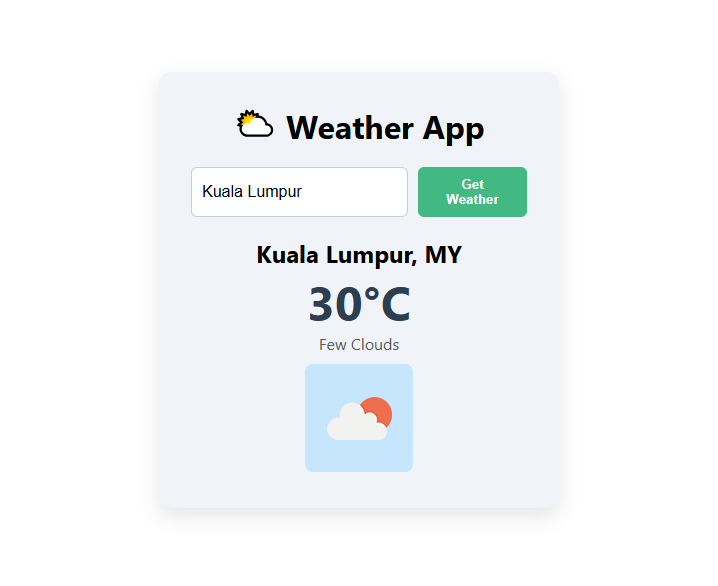

# 🌦️ Vue 3 Weather App

A simple, Weather App built with **Vue 3 Composition API**, using the **OpenWeatherMap API** and deployed with **Netlify**.

Check out the live app 👉 [https://vue-weather-app-test.netlify.app](https://vue-weather-app-test.netlify.app)

---

## 🚀 Features

- Search for current weather by city
- Fetches data from OpenWeatherMap API
- Shows temperature, weather description, and icon
- Handles errors (e.g. city not found)
- Shows loading states

---

## 🔧 Technologies

- [Vue 3](https://vuejs.org/) + Composition API
- [Vite](https://vitejs.dev/) for fast dev/build
- [OpenWeatherMap API](https://openweathermap.org/api)
- [Netlify](https://netlify.com) for hosting
- Vanilla CSS for styling

## 🤓 What I Learned
- Working with APIs in Vue using fetch()
- Using Composition API (ref, script setup)
- Handling loading and error states
- Using .env and import.meta.env securely
- Deploying Vue apps to Netlify
- Managing API keys in a frontend context

---

Made with ❤️ while learning Vue 3